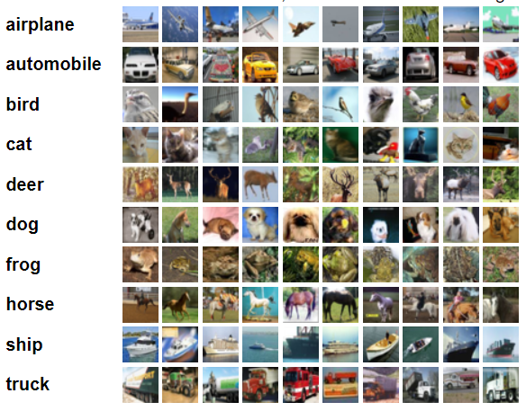
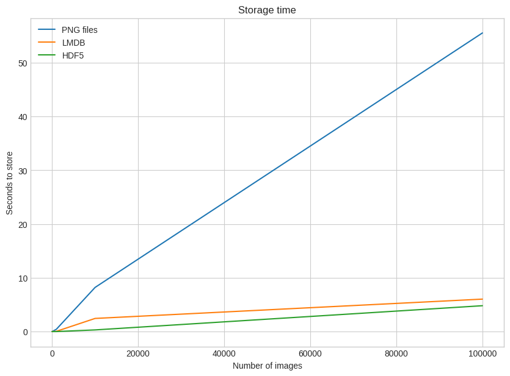
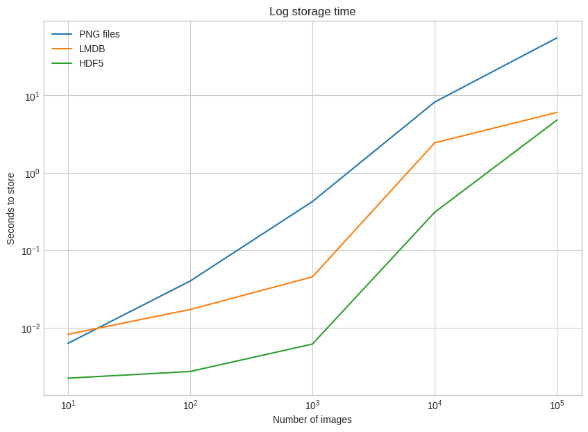
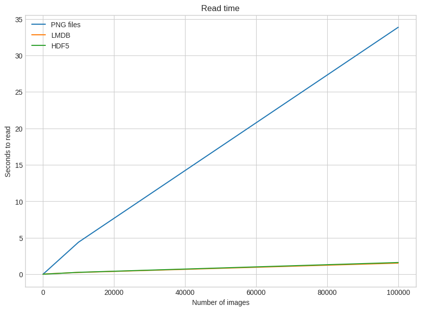
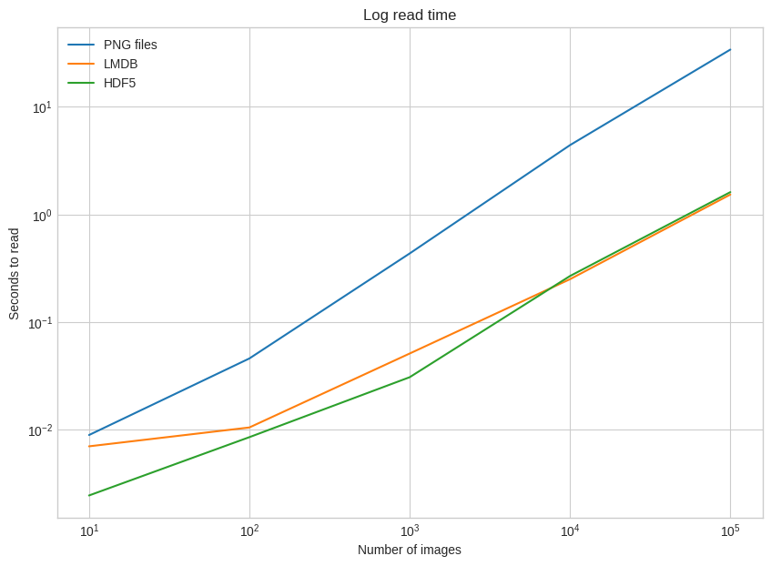
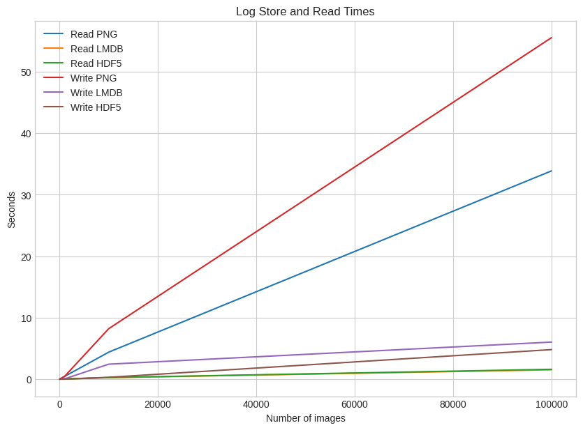
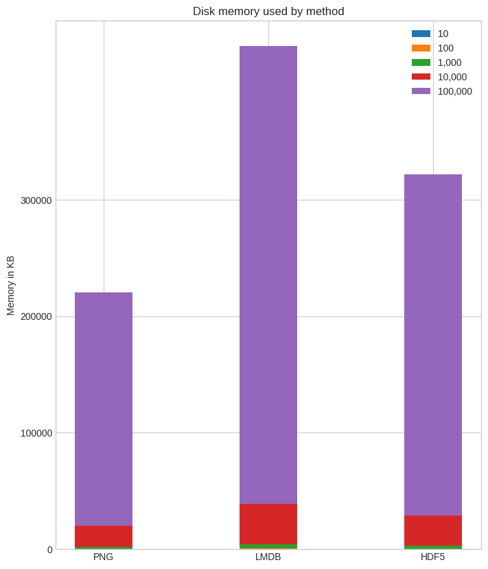

# **Tugas Database Multimedia**
* Muhammad Arsal Ranjana Utama
* 121450111
* RA

# Three Ways of Storing and Accessing Lots of Images in Python 
> https://realpython.com/storing-images-in-python/

Ketika berurusan dengan kumpulan data gambar yang besar, metode penyimpanan tradisional mungkin tidak dapat menyelesaikannya. Dengan tugas seperti melatih jaringan saraf konvolusional pada kumpulan data besar seperti ImageNet, memuat gambar ke dalam memori dapat memakan waktu. Di sinilah metode penyimpanan alternatif seperti LMDB dan HDF5 berperan. Dalam tutorial ini, kita akan mengeksplorasi mengapa metode ini layak dipertimbangkan, perbedaan kinerjanya dibandingkan dengan penyimpanan tradisional, dan bagaimana metode tersebut ditumpuk dalam hal *disk usage*.
# Data That We Used For This Experiment
Dalam eksperimen ini, kami akan menggunakan kumpulan data CIFAR-10 dari Canadian Institute for Advanced Research. CIFAR-10 terdiri dari 60.000 gambar berwarna berukuran 32x32 piksel, masing-masing diklasifikasikan ke dalam berbagai kategori objek seperti anjing, kucing, dan pesawat terbang.


*CIFAR-10 Example Images*

>https://www.cs.toronto.edu/~kriz/cifar.html

# Methods That We'll be Using
## LMDB

**LMDB**, juga dikenal sebagai "Lightning Database", adalah singkatan dari Lightning Memory-Mapped Database karena kecepatannya dan penggunaan file yang dipetakan memori *Memory-Mapped Files* . LMDB beroperasi sebagai penyimpanan nilai kunci, menggunakan struktur pohon B+ untuk penyimpanan dan pengambilan yang efisien. Struktur ini dioptimalkan berdasarkan ukuran halaman sistem operasi host, sehingga meningkatkan kinerja. Efisiensi LMDB semakin didukung oleh sifat pemetaan memorinya, yang memberikan penunjuk langsung ke alamat memori, sehingga menghilangkan kebutuhan akan penyalinan data.

## HDF5
**HDF5**, atau Hierarchical Data Format, adalah format file yang dikembangkan sebagai evolusi dari HDF4. Berasal dari National Center for Supercomputing Applications, HDF5 banyak digunakan untuk menyimpan data ilmiah. HDF5 terdiri dari dua objek utama: kumpulan data **dataset*, yang merupakan array multidimensi, dan grup, yang dapat berisi kumpulan data atau grup lain. Kumpulan data di HDF5 harus memiliki dimensi dan tipe yang seragam, terdiri dari larik berdimensi N yang homogen.

## Traditional 
Metode tradisional menyimpan gambar langsung ke disk melibatkan menyimpannya dalam format umum seperti .png atau .jpg tanpa lapisan abstraksi tambahan. 

# Storing a Single Image
Perbandingan ini akan berfungsi sebagai pengenalan tentang cara kerja masing-masing metode, dengan contoh kode yang diberikan. Kami akan menguji kinerja pada jumlah file yang berbeda, mulai dari satu gambar hingga 100.000 gambar, menggunakan faktor 10. Untuk eksperimen kami, kami akan menggunakan kumpulan CIFAR-10, dengan total 50.000 gambar, yang dapat kami gandakan hingga mencapai 100.000 gambar .

```
from timeit import timeit

store_single_timings = dict()

for method in ("disk", "lmdb", "hdf5"):
    t = timeit(
        "_store_single_funcs[method](image, 0, label)",
        setup="image=images[0]; label=labels[0]",
        number=1,
        globals=globals(),
    )
    store_single_timings[method] = t
    print(f"Method: {method}, Time usage: {t}")
```
Output :
>  Method: disk, Time usage: 0.013512245999891093
Method: lmdb, Time usage: 0.007620325000061712
Method: hdf5, Time usage: 0.0023656040000332723

Dalam konteks *storing a single image* / menyimpan satu gambar, hasiil mengungkapkan penggunaan waktu untuk tiga metode: **disk**, **LMDB**, dan **HDF5**. Hasilnya menunjukkan bahwa HDF5 memiliki penggunaan waktu tercepat (0,002 detik), diikuti oleh LMDB (0,007 detik), dan penyimpanan disk memiliki penggunaan waktu paling lambat (0,013 detik).

# Storing Many Images
Lalu bagaimana perbandingan ketiga metode ketika menyimpan gambar yang berbeda ? 

```
_store_many_funcs = dict(
    disk=store_many_disk, lmdb=store_many_lmdb, hdf5=store_many_hdf5
)

from timeit import timeit

store_many_timings = {"disk": [], "lmdb": [], "hdf5": []}

for cutoff in cutoffs:
    for method in ("disk", "lmdb", "hdf5"):
        t = timeit(
            "_store_many_funcs[method](images_, labels_)",
            setup="images_=images[:cutoff]; labels_=labels[:cutoff]",
            number=1,
            globals=globals(),
        )
        store_many_timings[method].append(t)

        # Print out the method, cutoff, and elapsed time
        print(f"Method: {method}, Time usage: {t}")
```
Output : 

> Method: disk, Time usage: 0.006231326000033732
Method: lmdb, Time usage: 0.008157640000035826
Method: hdf5, Time usage: 0.0022126890000890853
Method: disk, Time usage: 0.039865145000021585
Method: lmdb, Time usage: 0.017080639999903724
Method: hdf5, Time usage: 0.002698586999940744
Method: disk, Time usage: 0.4252777250001145
Method: lmdb, Time usage: 0.04512228399994456
Method: hdf5, Time usage: 0.00611033099994529
Method: disk, Time usage: 8.206039150999914
Method: lmdb, Time usage: 2.4423044600000594
Method: hdf5, Time usage: 0.3088613959998838
Method: disk, Time usage: 55.50677291000011
Method: lmdb, Time usage: 6.033562983000138
Method: hdf5, Time usage: 4.808491384000035

What if we visualize it ?

>Plot tersebut menunjukkan waktu penyimpanan yang diperlukan untuk ketiga metode (file PNG pada disk, LMDB, dan HDF5) seiring dengan bertambahnya jumlah gambar secara linier. Pada plot terlihat jelas menunjukkan bahwa file PNG pada metode disk memiliki waktu penyimpanan tertinggi, yang meningkat pesat seiring bertambahnya jumlah gambar. Metode LMDB berkinerja lebih baik daripada file PNG, namun metode HDF5 mengungguli keduanya, memerlukan waktu penyimpanan paling sedikit bahkan untuk gambar dalam jumlah besar.


>Untuk mempermudah perbedaan waktu penyimpanan pada jumlah gambar, kita dapat menampilkan plot dengan skala logaritmik pada sumbu y. Plot ini menyoroti keunggulan kinerja HDF5 yang signifikan dibandingkan dua metode lainnya, terutama untuk kumpulan data yang lebih kecil.

**HDF5 Wins !**

# Reading a Single Image
Lalu bagaimana performa read pada ketiga metode tersebut ? 

```
from timeit import timeit

read_single_timings = dict()

for method in ("disk", "lmdb", "hdf5"):
    t = timeit(
        "_read_single_funcs[method](0)",
        setup="image=images[0]; label=labels[0]",
        number=1,
        globals=globals(),
    )
    read_single_timings[method] = t
    print(f"Method: {method}, Time usage: {t}")
```
Output :
> Method: disk, Time usage: 0.0017979159999867989
Method: lmdb, Time usage: 0.0003480940001736599
Method: hdf5, Time usage: 0.0019738959999813233

Dengan kode diatas kita dapat mengetahui performa ketiga metode ketika membaca / *read* sebuah gambar. Dapat terlihat pada ketiga metode tersebut **tidak berbeda secara signifikan** ketika membaca sebuah gambar, bahkan metode tradisional menggungguli metode lainnya secara marginal. Aneh bukan ?


# Reading Many Images
Lalu bagaimana jika kita membaca gambar dalam jumlah yang banyak ?

```
from timeit import timeit

read_many_timings = {"disk": [], "lmdb": [], "hdf5": []}

for cutoff in cutoffs:
    for method in ("disk", "lmdb", "hdf5"):
        t = timeit(
            "_read_many_funcs[method](num_images)",
            setup="num_images=cutoff",
            number=1,
            globals=globals(),
        )
        read_many_timings[method].append(t)

        # Print out the method, cutoff, and elapsed time
        print(f"Method: {method}, No. images: {cutoff}, Time usage: {t}")
```
Output :
> Method: disk, No. images: 10, Time usage: 0.008943990000034319
Method: lmdb, No. images: 10, Time usage: 0.007024887999932616
Method: hdf5, No. images: 10, Time usage: 0.00245715799997015
Method: disk, No. images: 100, Time usage: 0.045927525000024616
Method: lmdb, No. images: 100, Time usage: 0.010510112000019944
Method: hdf5, No. images: 100, Time usage: 0.008543084999928396
Method: disk, No. images: 1000, Time usage: 0.4335843720000412
Method: lmdb, No. images: 1000, Time usage: 0.0510746410000138
Method: hdf5, No. images: 1000, Time usage: 0.03078050199997051
Method: disk, No. images: 10000, Time usage: 4.393096988000025
Method: lmdb, No. images: 10000, Time usage: 0.24999368500016317
Method: hdf5, No. images: 10000, Time usage: 0.2676439900001242
Method: disk, No. images: 100000, Time usage: 33.854493907000005
Method: lmdb, No. images: 100000, Time usage: 1.526834794000024
Method: hdf5, No. images: 100000, Time usage: 1.6082435040000291

Dengan membaca banyak gambar dibandingkan membaca sebuah gambar, ketiga metode tersebut akhirnya teruji dengan benar. Bila ditinjau secara kilas pada saat membaca 100000 gambar,  waktu eksekusi metode tradisional / *disk* meledak secara eksponensial. Hal tersebut sangat terlihat beda dengan metode HDF5 dan lmdb. 

Mari kita visualisasikan 


>Terlihat pada visualisasi Read Time diatas, metode HDF5 dan LMDB relatif sama dalam kemampuan membaca gambar seiring betambahnya gambar tersebut. Namun, metode tradisional meledak secara eksponensial dalam kemampuan membaca gambar seiring bertambahnya gambar tersebut.



>Untuk mempermudah perbedaan waktu membaca pada gambar yang banyak, kita dapat menampilkan plot dengan skala logaritmik pada sumbu y kembali. Seperti pada sebelumnya, pada plot ini menyoroti keunggulan kinerja HDF5 dan LMDB yang signifikan lebih cepat dibandingkan dengan metode tradisional



>Visualisasi Menyimpan dan Membaca dalam skala logaritmik pada sumbu y. Terlihat secara jelas bahwa metode tradisional jauh dalam segi menyimpan dan membaca. Bila ditinjau secara marginal, metode HDF5 lebih unggul dibandingkan metode LMDB dalam segi membaca gambar gambar tersebut. 


# Considering Disk Usage
Selain kecepatan komputasi, metrik kinerja penting lainnya adalah penggunaan ruang disk / *disk space usage*, terutama saat menangani dataset besar. Bayangkan Anda memiliki kumpulan data gambar berukuran 3 TB yang sudah disimpan di disk. Saat menggunakan metode penyimpanan alternatif, seperti LMDB atau HDF5, pada dasarnya Anda membuat salinan kumpulan data lain, sehingga menambah persyaratan penyimpanan. Pertukaran ini menawarkan manfaat kinerja yang signifikan namun memerlukan ruang disk yang cukup. Di bawah ini adalah ruang disk yang digunakan oleh setiap metode penyimpanan pada jumlah gambar yang berbeda:




>Plot tersebut membandingkan penggunaan memori disk dari tiga metode tersebut pada berbagai ukuran data mulai dari 10 hingga 100.000 gambar. Untuk ukuran data 10 gambar dan 100 gambar, tidak terlihat jelas metode mana yang mengkonsumsi memori disk paling sedikit. Namun, seiring bertambahnya ukuran data menjadi 1.000, 10.000, dan 100.000 gambar, metode HDF5 menjadi yang paling efisien dalam hal penggunaan memori disk, sehingga memerlukan ruang disk yang jauh lebih sedikit dibandingkan dua metode lainnya. Dengan kecepatan komputasi metode LMDB yang hampir sama dengan HDF5, akan tetapi ada yang dikorbankan dalam metode LMDB ini yaitu penggunaan memorinya yang tinggi dari HDF5. Dan dari plot tersebut kita dapat mengetahui secara singkatnya, meskipun metode tradisional lebih hemat memori untuk kumpulan data kecil, HDF5 mengungguli dua metode lainnya dengan memanfaatkan ruang disk secara lebih efisien saat menangani kumpulan data yang lebih besar.